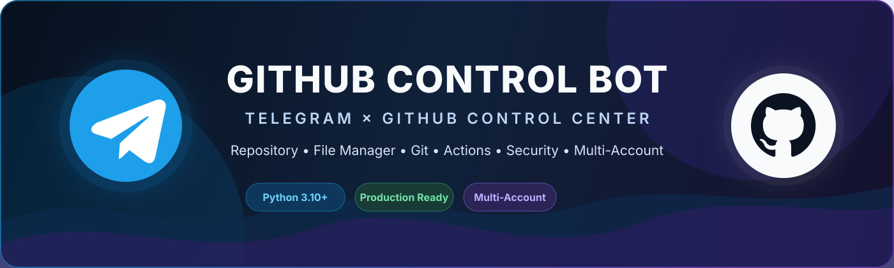

<p align="center">
  
</p>

<p align="center">
  <strong>Telegram-based GitHub Control Center</strong><br/>
  Repository management, File & Folder Manager, Git operations, Actions, security, notifications, releases, and multi-account control from one bot.
</p>

<p align="center">
  
  
  
  
  
</p>

## Overview

GitHub Control Bot provides a Telegram interface for managing GitHub repositories without repeatedly opening the GitHub website or server terminal. It combines GitHub API operations with a local Git working tree for file management, commits, branches, diff inspection, synchronization, and controlled repository maintenance.

## Main Features

### Repository Management

- Repository dashboard and health overview
- Repository creation, rename, archive/unarchive, transfer, and delete workflows
- Description, homepage, topics, visibility, and default branch controls
- Favorites, recent repositories, unified search, and batch operations
- Collaborators and permissions
- Branch protection and repository rulesets

### File & Folder Manager

- Browse repository files and folders
- Create nested folders
- Create files from Telegram text
- Create file content from uploaded `.txt`
- Upload multiple documents
- Upload photo, video, audio, voice, GIF/animation, and video notes
- Upload and safely extract ZIP archives
- Download, rename, and delete files
- Pagination and safe path validation
- Automatic repository clone when a local working tree is first required

### Git Operations

- Clone, status, diff, log, fetch, pull, and push
- Commit and Commit + Push
- Local branch management and checkout
- Stash and stash pop
- Cherry-pick and revert
- Compare refs and tags
- Selective commit
- README editor
- Conflict helper
- Safety backup branches
- Controlled reset and auto-sync

### GitHub Workflows

- Issues and Pull Requests
- Labels and milestones
- Releases and release assets
- GitHub Actions runs, jobs, logs, rerun, cancel, delete, and dispatch
- Repository secrets and variables
- Security dashboard and token health
- GitHub event notifications through Telegram

### Multi-Account

- Two independent GitHub accounts
- Separate GitHub tokens and default owners
- Per-account favorites, recent repositories, batch selection, and notification state
- Separate clone paths to avoid repository-name collisions
- Tokens remain outside persistent bot state

## Screenshots

Real sanitized UI screenshots should be stored under [`assets/screenshots/`](assets/screenshots/).

Recommended gallery files:

| Screen | File |
| --- | --- |
| Main menu | `assets/screenshots/01-home-menu.png` |
| Repository list | `assets/screenshots/02-repository-list.png` |
| Repository overview | `assets/screenshots/03-repository-overview.png` |
| File & Folder Manager | `assets/screenshots/04-file-manager.png` |
| Git operations | `assets/screenshots/07-git-operations.png` |
| Multi-account switcher | `assets/screenshots/10-account-switcher.png` |

See [`assets/screenshots/README.md`](assets/screenshots/README.md) for screenshot naming and privacy guidance.

## Project Structure

```text
github-control/
├── assets/
│   ├── banner.svg
│   └── screenshots/
│       └── README.md
├── docs/
│   ├── SECURITY.md
│   └── SETUP.md
├── scripts/
│   └── install.sh
├── .env.example
├── .gitignore
├── CONTRIBUTING.md
├── LICENSE
├── README.md
├── check_config.py
├── ecosystem.config.cjs
├── github_control_bot.py
└── requirements.txt
```

## Requirements

- Linux server
- Python 3.10+
- Git
- GitHub CLI (`gh`)
- Node.js + PM2 for production process management
- Telegram bot token
- GitHub personal access token with only the permissions required by the features you use

## Install

```bash
git clone https://github.com/baska-pro/github-control.git
cd github-control
bash scripts/install.sh
nano .env
.venv/bin/python check_config.py
pm2 start ecosystem.config.cjs
pm2 save
```

Full instructions are available in [`docs/SETUP.md`](docs/SETUP.md).

## Configuration

The application reads `.env` from the repository root.

Account 1:

```env
GITHUB_TOKEN=
GITHUB_OWNER=
GITHUB_ALIAS_1=Akun 1
```

Optional account 2:

```env
GITHUB_TOKEN_2=
GITHUB_OWNER_2=
GITHUB_ALIAS_2=Akun 2
```

Telegram access is restricted through `TELEGRAM_ADMIN_IDS`.

## Telegram Flow

```text
/menu
  └─ Repository
      └─ Select repository
          └─ Files & Git
              └─ File & Folder Manager
```

When a repository has not yet been cloned locally, file-management operations can initialize the local working tree automatically.

## Security

- `.env`, runtime state, logs, virtual environments, temporary files, clones, and backups are ignored by Git.
- Restrict bot access using `TELEGRAM_ADMIN_IDS`.
- Prefer fine-grained GitHub PATs where possible.
- Grant only the minimum repository permissions required.
- Never expose real tokens in screenshots, commits, issues, logs, or documentation.

See [`docs/SECURITY.md`](docs/SECURITY.md).

## Contributing

See [`CONTRIBUTING.md`](CONTRIBUTING.md).

## License

This project uses the **BASKA-PRO PERSONAL USE LICENSE Version 1.0**.

Personal, private, and non-commercial use is permitted under the terms in [`LICENSE`](LICENSE). Redistribution, commercial use, rebranding, SaaS/hosted resale, and other uses outside the license require prior written permission from the copyright holder.
